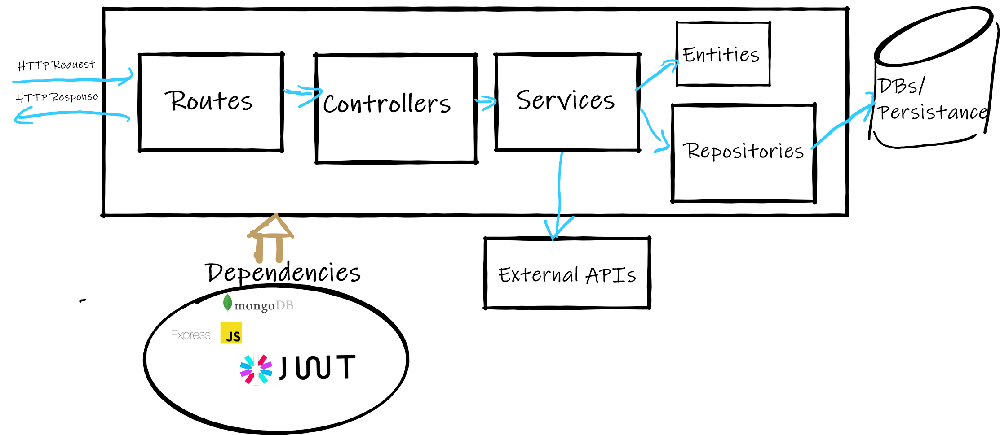

# Express

This lab enhances the simple API from last week.

In this lab you will:
- Create an API for managing users and movies.
- Use In-Memory Repository to persist data.
- Integrate the external TMDB API. 

## Architecture

This lab follows a layered approach that's inspired by the [clean architecure](https://blog.cleancoder.com/uncle-bob/2012/08/13/the-clean-architecture.html) approach. The goal is to produce resilient software that is divided into layers,  and is (reasonably) independent of technologies. Now we have already decided the technologies for this module. However,  choice of database, platform, or framework should be one of the last decisions. Furthermore, you should be able to swap out a infrastructure dependency without changing too much code. 

The following lab breaks the API up into the following structure:

A key feature of this approach is the "Dependency Rule", which is that source code dependencies can only point inwards. Nothing in an inner layer can "know" about something in an outer layer. For example, our API framework(``import express`` ) will not appear in the controllers, services or entities.  That also includes, functions, classes. variables, or any other named software entity.

Each layer can be described as follows: 

**Entities:** Core entities that are used in business use-cases and logic(e.g. Account, User, Movie)

**Repositories:** Defines database/ data store interactions.

**Services:** Contains the business scenarios that our api supports(e.g. register account, get movie details )

**Controllers:** Extract the parameters (query or body) from the HTTP request, call the relevant service, and return the HTTP response. In this case, they are actually routing middleware functions that we discussed in class.

**Routes:** Routes map received HTTP request to the correct controller. They can be used to chain together several controllers. 
