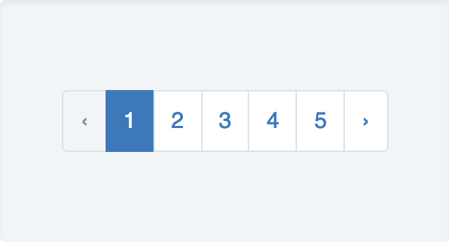

# Movies Router

We now need to update the **Movies Router** to use the Mongo DB.

## Get Movies

We have put a small set of data in our app for testing. In a production systems, there could be very large number of documents (in this case movies) in a response. **Pagination**, also known as paging, allows us to  divide the response into discrete pages and limit the number of documents returned in a singe request.  You would often see pagination in web apps as page numbers/tabs that allow users to navigate large result sets

Examine the structure of the API response to the endpoint **GET /api/movies**. The response contains  **page, total_results,** and **results** fields. The **total_results** is the total number of movies in the DB. The **page** indicates the page number of the results returned.   

The Mongoose Model object allows us to specify the *limit* the number of documents returned and *skip* to a particular document in a set of results. You will now update the API to use  **limit ** and **page** parameters from the request. The limit parameter will specify the maximum documents returned in each request and page will be used to calculate the number of documents to skip.   

+ Replace the entire contents of **/api/movies/index.js** with the following:

~~~javascript
import express from 'express';
import movieModel from './movieModel';
import asyncHandler from 'express-async-handler';
import { NotFound } from './../../responses';

const router = express.Router();

router.get('/', async (req, res) => {

    let { page = 1, limit = 4 } = req.query; // destructure page and limit and set default values
    [page, limit] = [+page, +limit]; //trick to convert to numeric (req.query will contain string values)

    const totalDocumentsPromise = movieModel.estimatedDocumentCount(); //Kick off async calls
    const moviesPromise = movieModel.find().limit(limit).skip((page - 1) * limit);

    const totalDocuments = await totalDocumentsPromise; //wait for the above promises to be fulfilled
    const movies = await moviesPromise;

    const returnObject = { page: page, total_pages: Math.ceil(totalDocuments / limit), total_results: totalDocuments, results: movies };//construct return Object and insert into response object

    res.status(200).json(returnObject);
});

export default router;
~~~

Examine the above code and note the comments for each section. The page and limit parameters are extracted from the request and then used to query the database for a particular page in ``movieModel.find().limit(limit).skip((page-1)*limit);``. 

 We use ``movieModel.estimatedDocumentCount();`` to get the total number of documents. 

Finally, when the results are returned, we construct the  ``returnObject`` and put it in the response. 

+ Check it works using default values by entering ``localhost:8080/api/movies/`` . You should see the same result as above.

+ Try again, this time specifying page and limit values in the URL: ``localhost:8080/api/movies/?page=2&limit=2``:

  

We only have a small set of data but you can limit the results and select a page. Test with different values of page and limit.

## Get a Movie

+ Add the following code to **/api/movies/index.js** to implement the **GET /api/movies/:id** and GET /api/movies/:id/reviews endpoints

~~~javascript
// Get movie details
router.get('/:id', async (req, res) => {
    const id = req.params.id;
    const movie = await movieModel.findById(id).exec();
    if (movie) {
        res.status(200).json(movie);
    } else {
        res.status(404).json(NotFound);
    }
});

~~~

Test the code as before. However, this time you will need to use a ``_id`` of a movie in the DB. Remember, the _id values  will change every time the app restarts as the DB is seeded and new values are computed. You can get one by doing GET /api/movies first and copy/paste a value:

We will leave the /api/movies/:id/reviews endpoint for the exercises

Handling Errors

## Commit it

Commit your work to your git repository.