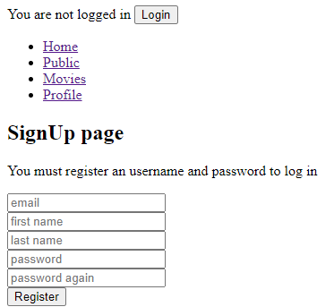

# React - SignUp Page

In this step you will update the sign up page to use the auth context and the movies API

+ Locate the file */src/signUpPage.js* and replace with the following code:

~~~javascript
import React, { useContext, useState } from "react";
import { Redirect } from "react-router-dom";
import { AuthContext } from './authContext';

const SignUpPage = props => {
  const context = useContext(AuthContext)
  const [email, setEmail] = useState("");
  const [password, setPassword] = useState("");
  const [passwordAgain, setPasswordAgain] = useState("");
  const [registered, setRegistered] = useState(false);
  const [firstName, setFirstName] = useState("");
  const [lastName, setLastName] = useState("");


  const register = () => {
    if (password.length > 0 && password === passwordAgain) {
      console.log("reg")
      context.register(email, password, firstName, lastName);
      setRegistered(true);
    }
  }

  const { from } = props.location.state || { from: { pathname: "/" } };

  if (registered === true) {
    return <Redirect to="./login" />;
  }

  return (
    <>
      <h2>SignUp page</h2>
      <p>You must register an  username and password to log in </p>
      <input value={email} placeholder="email" onChange={e => {
        setEmail(e.target.value);
      }}></input><br />
      <input value={firstName} placeholder="first name" onChange={e => {
        setFirstName(e.target.value);
      }}></input><br />
      <input value={lastName} placeholder="last name" onChange={e => {
        setLastName(e.target.value);
      }}></input><br />
      <input value={password} type="password" placeholder="password" onChange={e => {
        setPassword(e.target.value);
      }}></input><br />
      <input value={passwordAgain} type="password" placeholder="password again" onChange={e => {
        setPasswordAgain(e.target.value);
      }}></input><br />
      {/* Login web form  */}
      <button onClick={register}>Register</button>
    </>
  );
};

export default SignUpPage;
~~~

In the signup page we have included account fields that populate the state variables. When the *Register* button is pressed, the ``register`` function uses the context to register the username and password using the API.

## Add signUpPage Route

- Open */src/index.js* and add the following to the existing import statements:

```javascript
  import SignUpPage from "./signUpPage";
```

- Still in */src/index.js*, add the following Route component for the signUpPage to the existing Routes inside the `<Switch>`:

```javascript
  <Route path="/signup" component={SignUpPage} />
```

+ Test the SignUp feature by clicking on the *SignUp* button on the Login Page. **Remember you need to supply a valid email and password  that will pass API validation**
If successful, the Signup Page will redirect to the Login Page. Use the same username and password to log in. 



## Commit it!
Commit your changes
~~~bash
git add -A
git commit -m "React App - Sign up"
~~~

